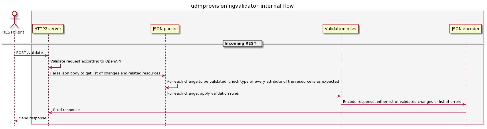

# UDM Provisioning Validator

[TOC]

## Description

UDM Provisioning Validator service is part of Provisioning Function (PF) and it provides a way for PF to validate provisioning changes in 5G subscription data, according to a set of [rules](https://gerrit.ericsson.se/plugins/gitiles/HSS/CCDM/EDA/documentation/+/master/uc/udm_provisioning_validator.adoc).

The RESTful API provided by the service, Validation API (V-API), is defined in [V-API](https://gerrit.ericsson.se/plugins/gitiles/activation/docs/api/v-api/+/master/src/provisioning_validation_api.yaml)

## Interfaces

 * **Ingress**: 
   * **http2** traffic port (default 9002) as main interface to manage validation requests.

## Architecture

### Design notes

This microservice is programmed in C++. Directory structure is shown and detailed below.

```
.
├── 3pp
│   ├── cpph2
│   ├── cpplog
│   ├── cppmonitor
│   └── cppopenapi
├── docker
├── groovy_files
├── helm
│   └── templates
├── jenkins
├── schema
├── src
│   ├── domain
│   ├── entities
│   └── ports
│       ├── json
│       ├── oaivalidator
│       └── server
└── test
```

 * **3pp**. It contains UDM proprietary C++ libraries defined as git submodules.
   * [**cpph2**](https://gerrit.ericsson.se/#/admin/projects/HSS/CCSM/cpph2). It handles all inbound and outbound http2 traffic.
   * [**cpplog**](https://gerrit.ericsson.se/#/admin/projects/HSS/CCSM/cpplog). It supports logging.
   * [**cppmonitor**](https://gerrit.ericsson.se/#/admin/projects/HSS/CCSM/cppmonitor). It monitors resources consumption (CPU and memory)
   * [**cppopenapi**](https://gerrit.ericsson.se/#/admin/projects/HSS/CCSM/cppopenapi). It validates HTTP requests/responses against OpenAPI.
 * **docker**. It contains the Dockerfile.
 * **groovy_files**. It contains scripts needed to define jobs for Continuous Integration (CI).
 * **helm**. It defines the Helm chart.
 * **jenkins**. It contains the script that runs the CI.
 * **src**. It contains the source code.
   * **domain**. It contains classes to validate input requests and outbound responses.
   * **entities**. It defines data types and validation rules.
   * **ports**.
     * **json**. It defines classes to parse json body from input requests and build json body for outbound responses.
     * **oaivalidator**. It defines an interface with the cppopenapi library to validate against OpenAPI.
     * **server**. It defines the HTTP server and its main logic.
 * **test**. It defines unit tests.



### Dependencies

#### Library dependencies

Apart from the proprietary libraries referenced in 3pp folder, some external libraries are used:
- boost, used for regular expressions, variant unions and algorithms to work with strings that are not part of the STL.
- rapidjson, used to parse and build JSON strings.
- Google Test, used for unit testing.

## Microservice Deployment

### Init Containers

There is not any init container.

### Containers

* <a name="eric-udm-udmprovisioningvalidator">eric-udm-udmprovisioningvalidator</a> (main container)
  >This is the main container of the deployment pod. It's running the HTTP server application that handles the REST operations and apply the validation rules.

* <a name="eric-udm-healthproxy">eric-udm-healthproxy</a> (healthproxy sidecar)
  >This is the container that handles the readinessProbe.

### Configmaps

* eric-udm-udmprovisioningvalidator-log-config
  > It specifies the log level for the application.

### Autoscaling

So far, udmprovisioningvalidator application scales using kubernetes Horizontal Pod Autoscaling. It scales the number of replicas according to CPU utilization percentage.
It uses several parameters that are set in values.yaml:

* minReplica: Minimum number of replicas which can be deployed.
* maxReplica: maximum number of replicas which can be deployed.
* targetCPUUtilizationPercentage: target CPU usage to scale.

### Service

**udmprovisioningvalidator** exposes one port outside of the pod:

* http2: Http main port where request gets to (Default `9002`).

## Overload

**udmprovisioningvalidator** uses the [overload protection mechanism](https://confluence.lmera.ericsson.se/pages/viewpage.action?spaceKey=5GHSS&title=Overload+Protection) provided by the cpph2 library, which is based on latency and resources consumption.

## OAM

### Metrics

There is not any metric defined.

### Alarms

There is not any alarm defined.

### Debug log level activation

Log level can be modified in an already running pod by editting the associated config map and adding the severity level in the logControl part:

```bash
kubectl edit configmap eric-udm-udmprovisioningvalidator-log-config
```

```yaml
# Please edit the object below. Lines beginning with a '#' will be ignored,
# and an empty file will abort the edit. If an error occurs while saving this file will be
# reopened with the relevant failures.
#
apiVersion: v1
data:
  logControl.json: |-
    [
            { "container": "eric-udm-udmprovisioningvalidator", "severity": "debug" }
    ]
kind: ConfigMap
metadata:
  creationTimestamp: "2020-01-20T15:48:18Z"
  name: eric-udm-udmprovisioningvalidator-log-config
  namespace: egoalva-test
  resourceVersion: "287579"
  selfLink: /api/v1/namespaces/egoalva-test/configmaps/eric-udm-udmprovisioningvalidator-log-config
  uid: 477a9745-3b9c-11ea-8ed7-0257a3c3ebb7
```

Log level takes around 30 seconds to refresh.

## [Helm Parameters](./helm/README.md)

